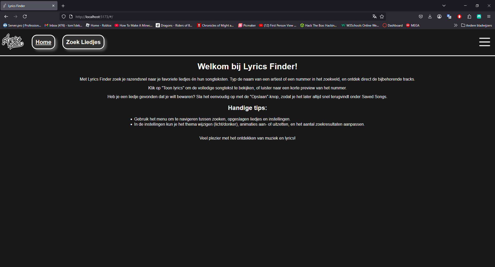

# Lyrics Finder - Single Page Application



## Projectbeschrijving en functionaliteiten

Lyrics Finder is een interactieve single-page applicatie waarmee gebruikers:
- Liedjes kunnen zoeken via de iTunes API
- Songteksten kunnen bekijken via de Lyrics.ovh API
- Favoriete liedjes kunnen opslaan (lokaal in browser)
- Instellingen kunnen aanpassen (thema, animaties, etc.)

### Hoofdfunctionaliteiten

1. **Dataverzameling & -weergave**
   - Haalt liedjesdata op van de iTunes API (max 25 resultaten)
   - Toont resultaten in visueel aantrekkelijke kaarten
   - Toont gedetailleerde informatie per liedje (artiest, album, genre, releasedatum, preview, lyrics)

2. **Interactiviteit**
   - Zoekfunctionaliteit met validatie (minimaal 2 karakters)
   - Filters (genre, tijdperk)
   - Sorteermogelijkheden (relevantie, titel, artiest, datum)
   - Lyrics overlay met toggle-functionaliteit

3. **Personalisatie**
   - Opslaan van favoriete liedjes (LocalStorage)
   - Thema voorkeuren (light/dark mode)
   - Animatie-instellingen
   - Aantal resultaten instelling (5-25)

4. **Gebruikerservaring**
   - Volledig responsive design (mobile/desktop)
   - Foutafhandeling met duidelijke meldingen
   - Intuïtieve navigatie met burgermenu
   - Lazy loading van afbeeldingen

---

## Gebruikte API's

1. **iTunes Search API**
   - Endpoint: `https://itunes.apple.com/search`
   - Gebruikt voor: Zoeken naar liedjes
   - Documentatie: [Apple Developer Docs](https://developer.apple.com/library/archive/documentation/AudioVideo/Conceptual/iTuneSearchAPI/)
   - Implementatie: `searchSongsScript.mjs` (regel 124-130)

2. **Lyrics.ovh API**
   - Endpoint: `https://api.lyrics.ovh/v1/{artist}/{title}`
   - Gebruikt voor: Ophalen songteksten
   - Documentatie: [Lyrics.ovh Docs](https://lyricsovh.docs.apiary.io/)
   - Implementatie: `searchSongsScript.mjs` (regel 196-210)

---

## Technische Implementatie

### DOM Manipulatie

| Concept                | Locatie                | Lijnnummers | Voorbeeld                          |
|------------------------|------------------------|-------------|------------------------------------|
| Elementen selecteren   | `searchSongsScript.mjs`| 45-50       | `document.getElementById()`        |
| Elementen manipuleren  | `searchSongsScript.mjs`| 160-240     | `innerHTML`, `classList`           |
| Events koppelen        | `burgerMenu.mjs`       | 15-25       | `addEventListener`                 |

### Modern JavaScript

| Concept           | Locatie                | Lijnnummers | Voorbeeld                           |
|-------------------|------------------------|-------------|-------------------------------------|
| Constantes        | `settingsScript.mjs`   | 5           | `SAVED_SONGS_KEY`                   |
| Template literals | `searchSongsScript.mjs`| 168-186     | `` `Artiest: ${artistName}` ``      |
| Array methodes    | `savedSongsScript.mjs` | 20          | `filter()`, `some()`                |
| Arrow functions   | `searchSongsScript.mjs`| 56          | `() => {}`                          |
| Async/Await       | `searchSongsScript.mjs`| 56, 124     | `async searchSongs()`               |
| Observer API      | `searchSongsScript.mjs`| 33-42       | `IntersectionObserver`              |

### Data & API

| Concept         | Locatie                | Lijnnummers | Details                |
|-----------------|------------------------|-------------|------------------------|
| Fetch API       | `searchSongsScript.mjs`| 124-130     | `safeFetch()` wrapper  |
| JSON manipulatie| `searchSongsScript.mjs`| 128         | `res.json()`           |

### Opslag & Validatie

| Concept        | Locatie                | Lijnnummers | Implementatie         |
|----------------|------------------------|-------------|-----------------------|
| LocalStorage   | `savedSongsScript.mjs` | 15-25       | `getItem/setItem`     |
| Form validatie | `searchSongsScript.mjs`| 114-120     | Minimaal 2 karakters  |

### Observer API Implementatie

```JavaScript
// searchSongsScript.mjs (lijnen 33-42)
const lazyLoadObserver = new IntersectionObserver((entries) => {
entries.forEach(entry => {
if (entry.isIntersecting) {
const img = entry.target;
img.src = img.dataset.src;
lazyLoadObserver.unobserve(img);
}
});
}, {
rootMargin: '200px'
});
```

---

## Belangrijke Functionaliteiten

| Functionaliteit         | Bestand               | Lijnnummers   |
|------------------------|-----------------------|--------------|
| Zoekfunctionaliteit    | searchSongsScript.mjs | 56-140       |
| Favorieten opslaan     | savedSongsScript.mjs  | 15-50        |
| Thema switching        | settingsScript.mjs    | 10-35        |
| Error handling         | errorHandling.mjs     | 1-60         |
| Routering              | router.mjs            | 1-30         |

---

## Installatiehandleiding

### Vereisten

- Node.js (v18+)
- npm (v9+)
- Moderne browser (Chrome, Firefox, Edge)

### Installatiestappen

1. **Clone de repository:**
    ```
    git clone https://github.com/tombomeke-ehb/lyrics-finder.git
    cd lyrics-finder
    ```

2. ***In geval van build mode(dir)***
   - download dir folder
      ```
      cd downloads
      cd dir
      ```

3. **Installeer dependencies:**
    ```
    npm install
    ```

4. **Start development server:**
    ```
    npm run dev
    ```

5. **Open de applicatie:**
    - [http://localhost:5173](http://localhost:5173)

---

## Screenshots

| Dark Mode | Light Mode |
|-----------|------------|
|  |  |
|  |  |
|  |  |
|  |  |
|  |  |
|  |  |
|  |  |
|  |  |
|  |  |
|  |  |
|  |  |
|  |  |
|  |  |

---

## Gebruikte bronnen

- [iTunes API Docs](https://developer.apple.com/library/archive/documentation/AudioVideo/Conceptual/iTuneSearchAPI/)
- [Lyrics.ovh API](https://lyricsovh.docs.apiary.io/)
- [MDN Web Docs](https://developer.mozilla.org/)
- [Vite Documentation](https://vitejs.dev/)
- [ChatGPT](https://chatgpt.com/share/682d1dd8-81bc-8006-8e0d-5d9ac1322948)
- [PerplexityAI](https://www.perplexity.ai/search/i-am-hosting-my-website-on-my-Clc8SB_QTG2u8tcxfBSoPQ)

---

## Commits geschiedenis

[Vorige Commits](./public/screenshots/commits.png)  
[Commit history](https://github.com/tombomeke-ehb/lyrics-finder/commits/main)


# Lyrics Finder - Single Page Application


## Project Description and Features

Lyrics Finder is an interactive single-page application that allows users to:
- Search for songs using the iTunes API
- View song lyrics via the Lyrics.ovh API
- Save favorite songs locally in the browser
- Adjust settings (theme, animations, etc.)

### Main Features

1. **Data Collection & Display**
   - Retrieves song data from the iTunes API (up to 25 results)
   - Displays results in visually appealing cards
   - Shows detailed information for each song (artist, album, genre, release date, preview, lyrics)

2. **Interactivity**
   - Search functionality with validation (minimum 2 characters)
   - Filters (genre, era)
   - Sorting options (relevance, title, artist, date)
   - Lyrics overlay with toggle functionality

3. **Personalization**
   - Save favorite songs (LocalStorage)
   - Theme preferences (light/dark mode)
   - Animation settings
   - Result count setting (5-25)

4. **User Experience**
   - Fully responsive design (mobile/desktop)
   - Error handling with clear messages
   - Intuitive navigation with burger menu
   - Lazy loading of images

---

## Used APIs

1. **iTunes Search API**
   - Endpoint: `https://itunes.apple.com/search`
   - Used for: Searching for songs
   - Documentation: [Apple Developer Docs](https://developer.apple.com/library/archive/documentation/AudioVideo/Conceptual/iTuneSearchAPI/)
   - Implementation: `searchSongsScript.mjs` (lines 124-130)

2. **Lyrics.ovh API**
   - Endpoint: `https://api.lyrics.ovh/v1/{artist}/{title}`
   - Used for: Fetching song lyrics
   - Documentation: [Lyrics.ovh Docs](https://lyricsovh.docs.apiary.io/)
   - Implementation: `searchSongsScript.mjs` (lines 196-210)

---

## Technical Implementation

### DOM Manipulation

| Concept                | Location                | Line Numbers | Example                          |
|------------------------|------------------------|--------------|----------------------------------|
| Selecting elements     | `searchSongsScript.mjs`| 45-50        | `document.getElementById()`      |
| Manipulating elements  | `searchSongsScript.mjs`| 160-240      | `innerHTML`, `classList`         |
| Event listeners        | `burgerMenu.mjs`       | 15-25        | `addEventListener`               |

### Modern JavaScript

| Concept           | Location                | Line Numbers | Example                           |
|-------------------|------------------------|--------------|-----------------------------------|
| Constants         | `settingsScript.mjs`   | 5            | `SAVED_SONGS_KEY`                 |
| Template literals | `searchSongsScript.mjs`| 168-186      | `` `Artist: ${artistName}` ``     |
| Array methods     | `savedSongsScript.mjs` | 20           | `filter()`, `some()`              |
| Arrow functions   | `searchSongsScript.mjs`| 56           | `() => {}`                        |
| Async/Await       | `searchSongsScript.mjs`| 56, 124      | `async searchSongs()`             |
| Observer API      | `searchSongsScript.mjs`| 33-42        | `IntersectionObserver`            |

### Data & API

| Concept         | Location                | Line Numbers | Details                |
|-----------------|------------------------|--------------|------------------------|
| Fetch API       | `searchSongsScript.mjs`| 124-130      | `safeFetch()` wrapper  |
| JSON handling   | `searchSongsScript.mjs`| 128          | `res.json()`           |

### Storage & Validation

| Concept        | Location                | Line Numbers | Implementation         |
|----------------|------------------------|--------------|------------------------|
| LocalStorage   | `savedSongsScript.mjs` | 15-25        | `getItem/setItem`      |
| Form validation| `searchSongsScript.mjs`| 114-120      | Minimum 2 characters   |

### Observer API Implementation

```JavaScript
// searchSongsScript.mjs (lijnen 33-42)
const lazyLoadObserver = new IntersectionObserver((entries) => {
entries.forEach(entry => {
if (entry.isIntersecting) {
const img = entry.target;
img.src = img.dataset.src;
lazyLoadObserver.unobserve(img);
}
});
}, {
rootMargin: '200px'
});
```

---

## Key Features

| Feature                | File                  | Line Numbers   |
|------------------------|-----------------------|---------------|
| Search functionality   | searchSongsScript.mjs | 56-140        |
| Save favorites         | savedSongsScript.mjs  | 15-50         |
| Theme switching        | settingsScript.mjs    | 10-35         |
| Error handling         | errorHandling.mjs     | 1-60          |
| Routing                | router.mjs            | 1-30          |

---

## Installation Guide

### Requirements

- Node.js (v18+)
- npm (v9+)
- Modern browser (Chrome, Firefox, Edge)

### Installation Steps

1. **Clone the repository:**
    ```
    git clone https://github.com/tombomeke-ehb/lyrics-finder.git
    cd lyrics-finder
    ```

2. ***In case of using build mode(dir)***
   - download dir folder
      ```
      cd downloads
      cd dir
      ```

3. **Install dependencies:**
    ```
    npm install
    ```

4. **Start the development server:**
    ```
    npm run dev
    ```

5. **Open the application:**
    - [http://localhost:5173](http://localhost:5173)

---

## Screenshots

| Dark Mode | Light Mode |
|-----------|------------|
|  |  |
|  |  |
|  |  |
|  |  |
|  |  |
|  |  |
|  |  |
|  |  |
|  |  |
|  |  |
|  |  |
|  |  |
|  |  |

---
## Sources

- [iTunes API Docs](https://developer.apple.com/library/archive/documentation/AudioVideo/Conceptual/iTuneSearchAPI/)
- [Lyrics.ovh API](https://lyricsovh.docs.apiary.io/)
- [MDN Web Docs](https://developer.mozilla.org/)
- [Vite Documentation](https://vitejs.dev/)
- [ChatGPT](https://chatgpt.com/share/682d1dd8-81bc-8006-8e0d-5d9ac1322948)
- [PerplexityAI](https://www.perplexity.ai/search/i-am-hosting-my-website-on-my-Clc8SB_QTG2u8tcxfBSoPQ)

---

## Commit History

[Previous Commits](./public/screenshots/image.png)  
[Commit history](https://github.com/tombomeke-ehb/lyrics-finder/commits/main)
